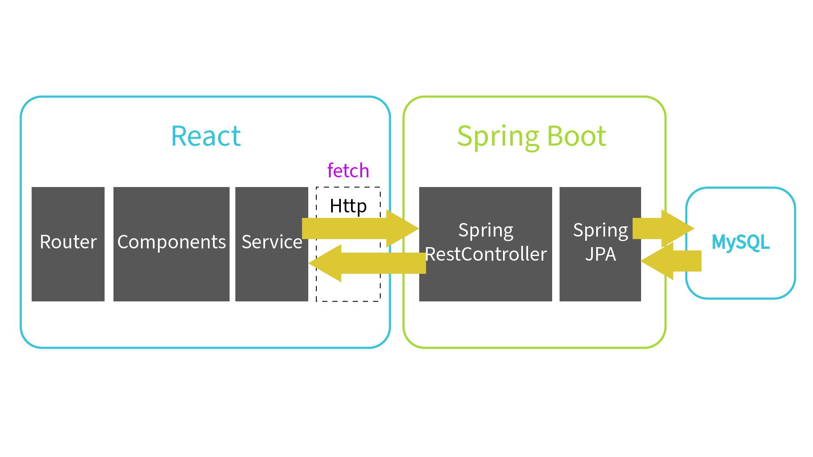

# SAE-501 Synapse

## Description

Application web de gestion de formations en ligne pour l'entreprise TXLFORMA. Projet dans le cadre de la SAE501 du BUT MMI.

Toutes les parties du projet (Front, Back, Base de données) se trouvent dans une image Docker afin de pouvoir tout lancer en une commande (Voir la partie Installation)

---

## Sommaire

- [Description](#description)
- [Liens annexes](#liens-annexes)
- [Technologies Utilisées](#technologies-utilisées)
- [Installation](#installation)
- [Comptes](#comptes)
- [Documentation de l'API](#documentation-de-lapi)
- [Architecture de l'application](#architecture-de-lapplication)
- [Architecture du projet](#architecture-du-projet)
- [Diagramme de classes](#diagramme-de-classes)

---

## Liens annexes

#### [Figma](https://www.figma.com/design/rCju9B0B6GPkQZQteJamXs/Untitled?node-id=0-1&t=zppyp5AM8Lq6ocLu-1)

#### [Google Sheets (Gestion de projet)](https://docs.google.com/spreadsheets/d/1pWGgZ2eqJKw4hhwJ4UL4aFLdzIzlTNApL_veXBvF-9M/edit?usp=sharing)

---

## Technologies Utilisées

### Frontend

- **React** (v19.1.1)
- **React Router DOM** (v7.9.5)
- **Vite** (v7.1.7)
- **Bootstrap** (v5.3.8)

### Visualisation de Données

- **Chart.js** (v4.5.1)
- **React Chart.js 2** (v5.3.1)
- **CountUp.js** (v2.9.0)

### Sécurité

- **bcryptjs** (v3.0.3)

### Backend
- **Sprint Boot** (v3.5.7)
- **MySQL** (v9.5.0)
- **Stripe** (v24.12.0)
- **OpenAPI/Swagger** (v2.8.14)
- **Maven** (v3.9.9)
- **Java** (v25)

### Outils de Développement

- **ESLint** (v9.36.0)
- **@vitejs/plugin-react** (v5.0.4)
- **IntelliJ IDEA** (v2025.2.2)

---

## Installation

### Prérequis

- Node.js (version 16 ou supérieure)
- npm ou yarn
- Docker
- Java 25

### Étapes d'installation

1. **Cloner le repository**

   ```bash
   git clone https://github.com/MatteoBaldinetti/SAE-501_Synapse.git
   cd SAE-501_Synapse
   ```

2. **Démarrer le container Docker**

   ```bash
   cd docker
   docker compose -p txlforma up -d
   ```
   
   L'application sera accessible à l'adresse : http://localhost:5173
   
   ---
   ###### Pour enlever le projet en entier
   ```bash
   docker-compose -p txlforma down -v
   ```

### Lancement individuel
   #### Web
   ```bash
   cd Web
   npm install
   npm run dev
   ```
   Accessible avec : http://localhost:5173

   #### API
   **Il faut d'abord lancer un serveur sql avant de lancer l'api**
   ```bash
   docker run -d --name txlforma-mysql -e MYSQL_ROOT_PASSWORD=txlforma -e MYSQL_DATABASE=txlforma -p 3306:3306 -v txlforma_db:/var/lib/mysql mysql:latest
   ```

   #### Lancement de l'api
   ```bash
   cd api
   .\mvnw.cmd clean package
   .\mvnw.cmd spring-boot:run
   ```
   Accessible avec : `http://localhost:8080/api/*`

---

## Comptes

### Étudiant
`camille.dupont@gmail.com` : `Azerty123!`

`lucas.moreau@gmail.com` : `Azerty123!`

### Enseignant
`sofia.bernard@gmail.com` : `Azerty123!`

### Admin
`admin@txlforma.fr` : `Admin123!`

---

## Documentation de l'API
Une fois l'api lancé, la documentation sera accessible avec : http://localhost:8080/swagger-ui.html.
Pour utiliser les endpoints, il faut mettre la clé d'api en cliquant sur `Authorize` et mettre `@txlforma2026!` dans `value`.

---

## Architecture de l'application


---

## Architecture du projet

### Web
```
root
│   .dockerignore
│   .gitignore
│   Dockerfile
│   index.html
│   nginx.conf
│   package-lock.json
│   package.json
│   vite.config.js
├───public
│   └───models
└───src
    ├───assets
    │   └───images
    ├───components
    │   ├───admin
    │   │   └───Forms
    │   └───prof
    │       └───Forms
    ├───constants
    ├───contexts
    ├───pages
    │   ├───3d
    │   ├───admin
    │   ├───errors
    │   ├───prof
    │   └───student
    └───styles
```
   ---
### API
```
root
│   .dockerignore
│   .gitignore
│   Dockerfile
│   pom.xml
├───src
│   └───main
│       ├───java
│       │   └───com
│       │       └───synapse
│       │           └───sae501
│       │               ├───config
│       │               ├───controllers
│       │               ├───dto
│       │               ├───exceptions
│       │               ├───filter
│       │               ├───mappers
│       │               ├───models
│       │               ├───repositories
│       │               ├───services
│       │               └───specifications
│       └───resources
│               application.properties
└───uploads
```

## Diagramme de classes


